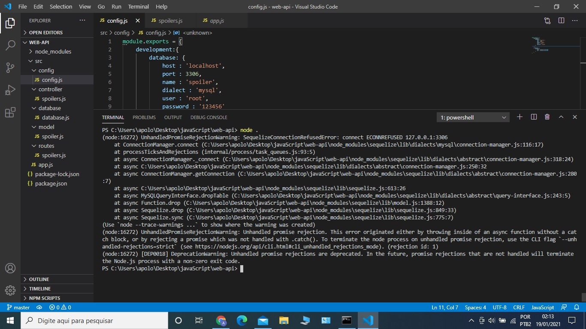
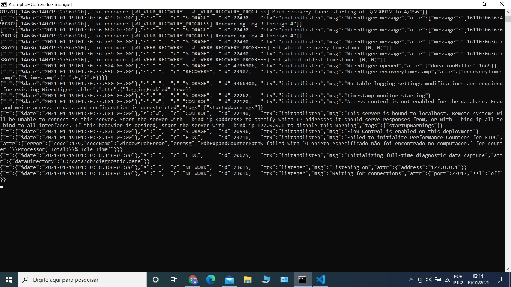

# API-RESTFful-com-Node.js
Esse projeto implementa uma API RESTful com Node.js. Faz parte de um exercício do curso de Node.js no devmedia.com.

Quando eu executo node . Aparece o seguinte erro:

Veja que o mongo ta rodando corretamente

